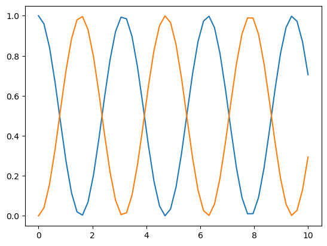

# Tutorial

## Setup

Para realizar este ejemplo, necesitamos utilizar numpy y matplotlib, por lo que debemos importarlos. Además, definimos las funciones de este módulo.

```python
import numpy as np
import matplotlib.pyplot as plt

# Función que modela la evolución temporal (ver Referencia)
def dyn_generator(oper, state):
    return -1j * (np.dot(oper, state) - np.dot(state, oper))

# Función que implementa el método RK4 (ver Referencia)
def rk4(func, oper, state, h):
    k1 = h * func(oper, state)
    k2 = h * func(oper, state + k1 / 2)
    k3 = h * func(oper, state + k2 / 2)
    k4 = h * func(oper, state + k3)

    return state + (k1 + 2*k2 + 2*k3 + k4) / 6
```

### Utilidades

Definimos los insumos `oOper` (el operador $\mathbf{O}$), `yInit`, el stado inicial del sistema, `times` y `h`.

```python
oOper = np.array([[0, 1], [1, 0]])
yInit = np.array([[1, 0], [0, 0]])
times = np.linspace(0, 10, 50)
h = times[1] - times[0]
```

## Arreglos donde se almacenarán los resultados

Aquí almacenaremos los datos para graficarlos posteriormente.

```python
stateQuant00 = np.zeros(times.size)
stateQuant11 = np.zeros(times.size)
```

## Iniciar el cálculo

Entramos al for loop con el rango de `times`, re-definimos el estado como el estado calculado (o el inicial en la primera iteración).

```python
for tt in range(times.size):
    stateQuant00[tt] = yInit[0, 0].real
    stateQuant11[tt] = yInit[1, 1].real

```

Actualizamos el estado con el método rk4:

```python
    yInit = rk4(dyn_generator, oOper, yInit, h)
```

Graficar:

```python
plt.plot(times, stateQuant00)
plt.plot(times, stateQuant11)
```


